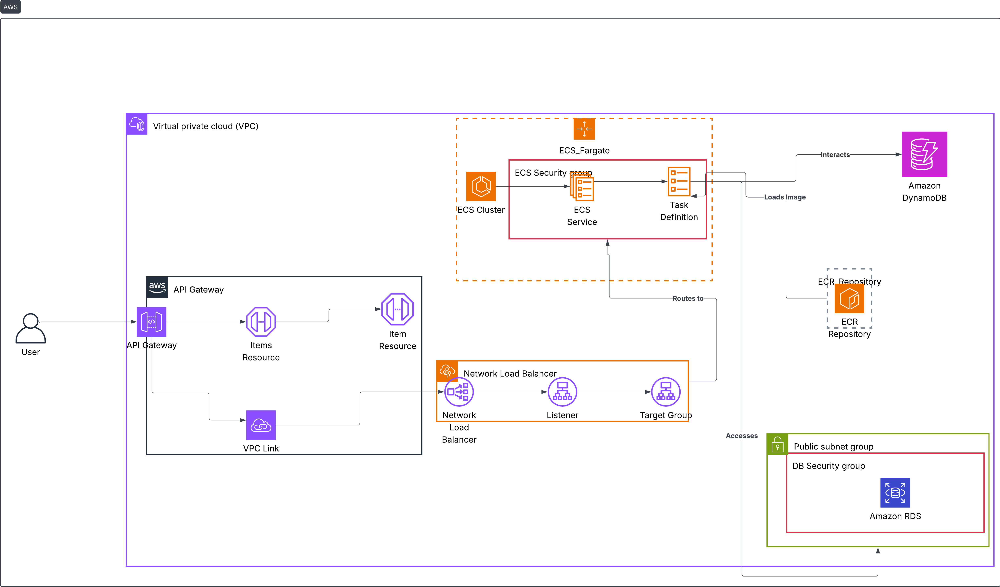

## Práctica de Aula 4 — Computación en la Nube

Esta es la solución de partida para la práctica de aula 4 de la asignatura de Computación en la Nube (EII-ULPGC). Proporciona una API REST de gestión de tickets desarrollada con Flask y preparada para desplegarse en AWS sobre ECS Fargate, con entrada por API Gateway y balanceo mediante un Network Load Balancer. La idea es que el alumno comprenda la arquitectura para en la parte bis realizar el desacoplamiento y demostración de la funcionalidad

### Diagrama de arquitectura



### Componentes principales
- **API Gateway (REST)**: expone los recursos `items` e `item` y enruta al backend vía VPC Link. Protegido con API Key.
- **VPC Link + NLB**: el VPC Link conecta API Gateway con un Network Load Balancer interno que apunta al servicio de ECS.
- **ECS Fargate**: ejecuta el contenedor de la app Flask definido en `Dockerfile` y `main.yml`.
- **Bases de datos**:
  - **PostgreSQL (Amazon RDS)** en el VPC, con SG de acceso al puerto 5432.
  - **Amazon DynamoDB** como alternativa NoSQL de tabla única.
- **Amazon ECR**: repositorio para la imagen del contenedor.

### Estructura del proyecto
- `app/main.py`: aplicación Flask con endpoints y CORS.
- `app/models/ticket.py`: modelo `Ticket` con validación Pydantic.
- `app/db/db.py`: interfaz abstracta de base de datos.
- `app/db/postgres_db.py`: implementación PostgreSQL.
- `app/db/dynamodb_db.py`: implementación DynamoDB.
- `app/db/factory.py`: selecciona la implementación según `DB_TYPE`.
- `Dockerfile`: imagen de la aplicación.
- `requirements.txt`: dependencias Python.
- `main.yml`: plantilla CloudFormation para API Gateway + VPC Link + NLB + ECS Fargate.
- `db_postgres.yml`: plantilla para RDS PostgreSQL.
- `db_dynamodb.yml`: plantilla para la tabla DynamoDB mínima.
- `ecr.yml`: plantilla para el repositorio ECR.
- `postgres.sql`: script SQL equivalente para crear la tabla localmente.
- `frontend.html`: HTML básico para probar la API vía API Gateway.

### API
- **POST** `/items`: crea un ticket.
- **GET** `/items`: lista de tickets.
- **GET** `/items/{ticket_id}`: obtiene un ticket.
- **PUT** `/items/{ticket_id}`: actualiza un ticket.
- **DELETE** `/items/{ticket_id}`: borra un ticket.
- **GET** `/health`: comprobación de vida.

Las respuestas de error gestionan validación (`pydantic`), integridad/operación de PostgreSQL y errores de DynamoDB.

### Variables de entorno
- **DB_TYPE**: `postgres` (por defecto) o `dynamodb`.
- Si `DB_TYPE=postgres`:
  - **DB_HOST**, **DB_NAME**, **DB_USER**, **DB_PASS**.
- Si `DB_TYPE=dynamodb`:
  - **DB_DYNAMONAME**: nombre de la tabla (por defecto `tickets`).

### Ejecución local (opcional)
```bash
python -m venv .venv && source .venv/bin/activate
pip install -r requirements.txt
# Ejemplo usando PostgreSQL local
export DB_TYPE=postgres DB_HOST=localhost DB_NAME=ticketsdb DB_USER=postgres DB_PASS=postgres
python app/main.py
# La API quedará en http://localhost:8080
```

### Contenedor
```bash
# Construir
docker build -t tickets-app:latest .
# Ejecutar
docker run --rm -p 8080:8080 \
  -e DB_TYPE=postgres \
  -e DB_HOST=host.docker.internal -e DB_NAME=ticketsdb -e DB_USER=postgres -e DB_PASS=postgres \
  tickets-app:latest
```

### Despliegue en AWS (CloudFormation)
Orden recomendado de plantillas:
1. `ecr.yml` → crea el repositorio y subir la imagen.
2. `db_postgres.yml` o `db_dynamodb.yml` → crea la base de datos elegida.
3. `main.yml` → despliega VPC Link, NLB, ECS Fargate, API Gateway y enlaza la imagen y variables.

Parámetros clave de `main.yml`:
- **ImageName**: `<repo>:<tag>` en ECR.
- **VpcId**, **SubnetIds**: VPC y subredes existentes.
- **DBType**: `postgres` o `dynamodb`.
- Campos de DB correspondientes: `DBHost`, `DBName`, `DBUser`, `DBPass` o `DBDynamoName`.

### Probar con `frontend.html`
`frontend.html` es una página estática que consume los endpoints del API Gateway usando `fetch` y la cabecera `x-api-key`.

Uso rápido:
1. Abrir el archivo `frontend.html` en el navegador (doble clic o `file:///...`).
2. En el modal de configuración inicial, introducir:
   - **API URL**: la URL del Stage (por ejemplo, `https://<rest-api-id>.execute-api.us-east-1.amazonaws.com/prod`).
   - **API Key**: el valor de la API Key creada por `main.yml`.
3. Pulsar “Conectar”.
4. Crear/editar/mover tickets en el tablero. Las operaciones llaman a `POST /items`, `GET /items`, `PUT /items/{id}` y `DELETE /items/{id}` del API Gateway.

Notas:
- La configuración (URL y API Key) se guarda en `localStorage` del navegador.
- Si la API Key no es válida o el CORS falla, la app mostrará un mensaje de error.

### Notas
- La región de las prácticas es `eu-east-1`.
- El contenedor expone el puerto 8080 y el NLB escucha en el mismo puerto.
